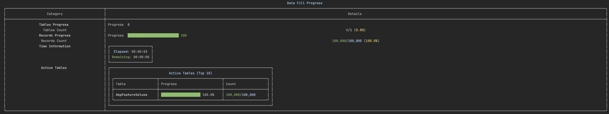

# Data Filler

A command-line tool for generating mock data in PostgreSQL database tables with real-time progress tracking.

English | [简体中文](./README_CN.md)



## ✨ Features

- 🔄 Data generation based on existing table data
- 📊 Multi-table concurrent data filling
- 🖥️ User-friendly CLI interface with real-time progress
- ⚡ High-performance batch insertion
- 🎯 Automatic handling of primary keys and unique indexes
- 🔀 Random order data insertion
- ⚙️ Configurable settings with JSON file support

## 🛠️ Tech Stack

- .NET Core 6.0
- SqlSugar ORM
- Spectre.Console
- PostgreSQL

## 🚀 Quick Start

1. **Run the program**:
   ```bash
   dotnet run
   ```

2. **Configure Database Connection**:
   - Enter your PostgreSQL connection string
   - Optionally save configuration to `config.json`

3. **Set Tables and Data Volume**:
   ```
   Format: table1,1000;table2,2000
   Example: users,10000;orders,20000
   ```

4. **Configure Batch Size**:
   - Default: 1000
   - Recommended range: 100-10000

5. **Configure Thread Count**:
   - Default: 10
   - Adjust based on your system's CPU cores and available resources

## 📝 Important Notes

1. Ensure target tables exist and contain sample data
2. Verify database user has sufficient permissions
3. Adjust batch size according to your data volume
4. Primary keys and unique indexes are handled automatically

## 🎯 Use Cases

- Development environment data population
- Performance testing with large datasets
- Database stress testing
- Demo data generation

## 📊 Performance

The tool provides real-time progress tracking with:
- Table-wise progress bars
- Record count statistics
- Estimated time remaining
- Active table status

## 🤝 Contributing

Contributions are welcome! Feel free to:
- Report issues
- Submit pull requests
- Suggest new features
- Improve documentation

## 📄 License

This project is licensed under the MIT License - see the LICENSE file for details.
