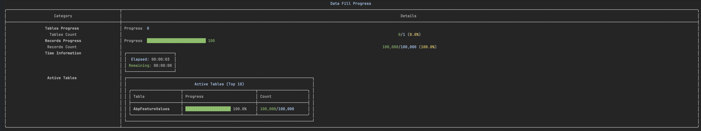

# Data Filler

用于在PostgreSQL数据库表中生成模拟数据的命令行工具，具有实时进度跟踪功能。

[English](./README.md) | 简体中文



## ✨ 特性

- 🔄 基于现有表数据的数据生成
- 📊 多表并发数据填充
- 🖥️ 用户友好的CLI界面，带实时进度
- ⚡ 高性能批量插入
- 🎯 自动处理主键和唯一索引
- 🔀 随机顺序数据插入
- ⚙️ 支持JSON文件的可配置设置

## 🛠️ 技术栈

- .NET Core 6.0
- SqlSugar ORM
- Spectre.Console
- PostgreSQL

## 🚀 快速开始

1. **运行程序**:
   ```bash
   dotnet run
   ```

2. **配置数据库连接**:
   - 输入您的PostgreSQL连接字符串
   - 可选择将配置保存到`config.json`

3. **设置表和数据量**:
   ```
   格式: 表1,1000;表2,2000
   示例: users,10000;orders,20000
   ```

4. **配置批处理大小**:
   - 默认值: 1000
   - 建议范围: 100-10000

## 📝 重要说明

1. 确保目标表存在且包含示例数据
2. 验证数据库用户具有足够的权限
3. 根据数据量调整批处理大小
4. 自动处理主键和唯一索引

## 🎯 使用场景

- 开发环境数据填充
- 大数据集性能测试
- 数据库压力测试
- 演示数据生成

## 📊 性能

该工具提供实时进度跟踪，包括：
- 表级进度条
- 记录数统计
- 预计剩余时间
- 活动表状态

## 🤝 贡献

欢迎贡献！您可以：
- 报告问题
- 提交拉取请求
- 建议新功能
- 改进文档

## 📄 许可证

本项目采用MIT许可证 - 详见LICENSE文件。
